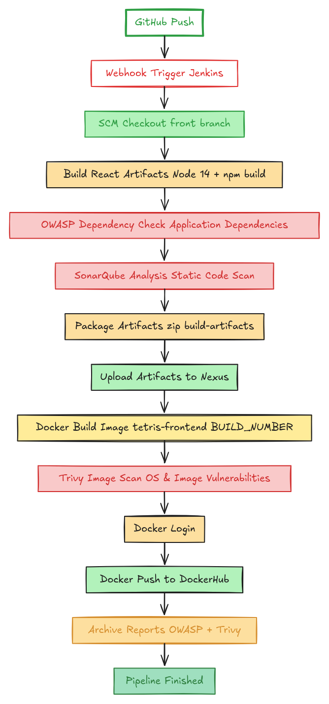

### 🎮 Tetris Project – Local Setup Guide (Node 14) : 
This project consists of:
- React Frontend (served by Nginx)
- Node.js Backend API (Node 14)
- Redis (Leaderboard storage)
All services run in Docker containers connected via one Docker network.
## ✅ Prerequisites
Make sure you have installed:
```git
docker
node (14.x)
npm

```
Check versions:
```git --version
docker --version
node -v
npm -v

```
⚠️ This project is tested with Node.js 14.x.
Using another version may cause build issues.
## 📁 Project Structure
```Tetris-End-To-End-Project/
├── frontend/
│   ├── Dockerfile
│   ├── nginx.conf
│   ├── package.json
│   ├── src/
│   └── public/
│
├── backend/
│   ├── Dockerfile
│   ├── server.js
│   └── package.json
│
└── README.md

```
## 🚀 Run Everything Locally (Step by Step)
### 1️⃣ Clone Repository
```git clone https://github.com/shymaasaed/Tetris-End-To-End-Project
cd tetris-project

```
### 2️⃣ Create Docker Network
All containers must be on the same network:
```docker network create tetris-net

```
### 3️⃣ Run Redis
```docker run -d \
--name redis \
--network tetris-net \
redis

```
Verify:
```docker ps

```
You should see redis running.
### 4️⃣ Build Frontend Image
```cd frontend
docker build -t tetris-frontend .

```
### 5️⃣ Run Frontend Container
```docker run -d \
--name frontend \
--network tetris-net \
-p 3000:80 \
tetris-frontend

```
Frontend will be available at:
👉 http://localhost:3000
### 6️⃣ Build Backend Image
Open a new terminal:
```cd backend
docker build -t tetris-backend .

```
### 7️⃣ Run Backend Container
```docker run -d \
--name backend \
--network tetris-net \
-p 4000:4000 \
-e REDIS_HOST=redis \
tetris-backend

```
Backend API will be available at:
👉 http://localhost:4000
Important:
- REDIS_HOST=redis must match Redis container name.
## 🧪 Backend Testing
#### Add score:
```curl -X POST http://localhost:4000/score \
-H "Content-Type: application/json" \
-d '{"playerId":"test","score":300}'

```
#### Get leaderboard:
```curl http://localhost:4000/leaderboard

```
You should receive leaderboard data.
## 🎮 Game Testing
Open browser:
👉 http://localhost:3000
Play the game.
After game over, score is automatically saved to Redis.
## 🚫 Important Notes
- Do NOT commit node_modules
- Do NOT commit .env files
- Redis hostname is provided using environment variables
- Frontend + Backend communicate through Docker network
## 🧹 Stop & Clean Everything
```docker rm -f frontend backend redis
docker network rm tetris-net

```
## ✅ Summary
This setup provides:
- React frontend in Nginx container
- Node 14 backend API container
- Redis container
- Docker network communication
- Persistent leaderboard
This mirrors real production architecture and prepares the project for AWS / EKS deployment.

# 🚀 Tetris Frontend – Jenkins DevSecOps Pipeline

This project demonstrates an end-to-end **DevSecOps CI/CD pipeline** for a React frontend application using Jenkins.  
The pipeline integrates application build, static analysis, dependency scanning, container security scanning, artifact management, and container deployment.

---

## 📌 Pipeline Flow



## 🛠️ Pipeline Stages

### 1️⃣ Checkout

Pulls the frontend source code from GitHub (front branch)
after the GitHub -Jenkins  webhook trigger .

---

### 2️⃣ Build Artifacts

Builds the React application using Node.js inside Docker.

Steps:
- Install dependencies
- Build React app
- Store output in `build-artifacts/`

Output:
- `build-artifacts/`

---

### 3️⃣ OWASP Dependency Check (Soft Scan)

Scans application dependencies for known CVEs.

Tool:
- OWASP Dependency-Check (Dockerized)

Output:
- `owasp-report/dependency-check-report.html`

Notes:
- Uses NVD API Key for faster updates
- Runs in soft mode (does not fail pipeline)

---

### 4️⃣ SonarQube Analysis

Performs static code analysis on frontend build artifacts.

Tool:
- SonarQube Scanner CLI

Metrics:
- Bugs
- Vulnerabilities
- Code Smells
- Maintainability

---

### 5️⃣ Push Artifacts to Nexus

Packages frontend build and uploads it to Nexus Raw Repository.

Output:
- `frontend-build-<BUILD_NUMBER>.zip`

---

### 6️⃣ Docker Build

Builds Docker image locally


---

### 7️⃣ Trivy Image Scan (Soft)

Scans Docker image for OS-level vulnerabilities.

Tool:
- Trivy

Output:
- `trivy-image.txt`

Runs in soft mode (pipeline continues even if vulnerabilities exist).

---

### 8️⃣ Docker Push

Pushes scanned image to DockerHub.

---

### 9️⃣ Archive Reports

Archives security reports inside Jenkins:

- Trivy report
- OWASP Dependency Check report

Accessible from Jenkins build artifacts.

---

## 📂 Generated Outputs

| File / Folder | Description |
|---------------|-------------|
| build-artifacts/ | React build output |
| frontend-build.zip | Artifact uploaded to Nexus |
| owasp-report/ | OWASP Dependency Check HTML report |
| trivy-image.txt | Trivy container scan result |

---

## 🔐 Jenkins Credentials Required

The following credentials must be configured in Jenkins:

### GitHub
- ID: `Creds-git`
- Type: Username / Token

### SonarQube
- ID: `sonar-creds`
- Type: Secret Text

### Nexus
- ID: `nexus-creds`
- Type: Username / Password

### DockerHub
- ID: `shymaa145`
- Type: Username / Access Token  
(Note: Docker Access Token is required, not account password.)

### NVD API Key
- ID: `nvd-api-key`
- Type: Secret Text

Used by OWASP Dependency Check.

---

## 🖥️ System Requirements

On Jenkins host:

- Docker
- Trivy
- Internet access
- SonarQube running on port `9000`
- Nexus running on port `8081`

Minimum recommended:

- 4 GB RAM
- 2 CPU cores

---

## 🔐 Required Permissions

Jenkins user must have permission to:

- Run Docker containers
- Build Docker images
- Push images to DockerHub
- Write to workspace

Example:

```bash
sudo usermod -aG docker jenkins

```


-